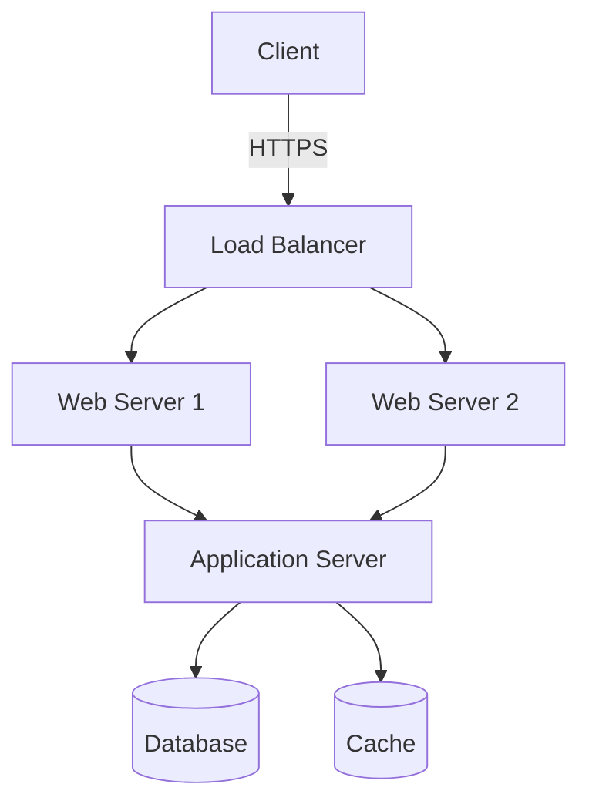

# Architecture Design Agents

A comprehensive suite of AI agents and skills to help technical architects generate software architecture designs, diagrams, and documentation using Claude AI.

## Overview

This project provides specialized agents that can analyze codebases, generate architecture diagrams in multiple formats, design APIs, visualize databases, and create comprehensive architecture documentation.

## Features

### 🏗️ Agents

#### Architecture & Design
1. **Architecture Analyzer Agent** - Analyzes codebases and generates architecture diagrams
2. **Diagram Generator Agent** - Creates diagrams in multiple formats (Mermaid, C4, PlantUML, draw.io)
3. **API Design Agent** - Designs and documents APIs with sequence diagrams
4. **Database Visualizer Agent** - Creates ER diagrams from database schemas
5. **Requirements Analyzer Agent** - Extracts and analyzes requirements from multiple document formats (DOCX, Excel, PDF, TXT)
6. **WBS Generator Agent** - Creates work breakdown structures, effort estimates, and presale proposals

#### Development & Quality
7. **Code Review Agent** - Automated code review for quality, security, performance, and best practices
8. **Test Case Generator Agent** - Generates comprehensive test cases (unit, integration, E2E, performance, security)
9. **Security Auditor Agent** - Performs security audits (OWASP Top 10, compliance, vulnerability scanning)

#### DevOps & Infrastructure
10. **DevOps Pipeline Designer Agent** - Designs CI/CD pipelines (GitHub Actions, Jenkins, GitLab CI)
11. **Infrastructure as Code Generator** - Generates IaC (Terraform, CloudFormation, ARM templates, Pulumi)

### 🎨 Diagram Formats Supported

- **Mermaid** - Flowcharts, sequence diagrams, class diagrams, ER diagrams, state diagrams
- **C4 Model** - Context, Container, Component, and Code diagrams
- **PlantUML** - UML diagrams, sequence diagrams, component diagrams
- **Draw.io XML** - Editable diagrams for Draw.io/diagrams.net

### 🤖 Autonomous Systems

1. **Workflow Orchestrator** - Execute complete workflows automatically (Requirements → Architecture → Documentation)
2. **Agent Runner** - Run agents on schedule or events (daily scans, PR reviews, continuous monitoring)
3. **Agentic System** - Claude-powered agents that think, plan, and execute autonomously

### 🛠️ Skills

- Diagram generation utilities
- Code analysis and pattern recognition
- Architecture pattern detection
- Documentation generation
- Autonomous workflow execution
- Multi-agent collaboration

## Project Structure

```
codingagents/
├── agents/                          # Agent implementations
│   ├── architecture-analyzer/       # Analyzes code and generates architecture
│   ├── diagram-generator/           # Generates diagrams in various formats
│   ├── api-designer/                # API design and documentation
│   ├── database-visualizer/         # Database schema visualization
│   ├── requirements-analyzer/       # Requirements extraction and analysis
│   ├── wbs-generator/               # Work breakdown structure and presale proposals
│   ├── code-reviewer/               # Automated code review and quality analysis
│   ├── test-generator/              # Test case generation (unit, integration, E2E)
│   ├── security-auditor/            # Security audits and vulnerability scanning
│   ├── devops-designer/             # CI/CD pipeline design
│   └── iac-generator/               # Infrastructure as Code generation
├── autonomous/                      # Autonomous agent systems
│   ├── orchestrator/                # Workflow orchestration and automation
│   ├── runner/                      # Scheduled and event-driven execution
│   └── agentic/                     # Claude-powered intelligent agents
├── skills/                          # Reusable skills
│   └── diagram-skills/              # Diagram generation capabilities
├── utils/                           # Utility functions
├── examples/                        # Example usage and outputs
│   ├── templates/                   # Architecture templates
│   └── output/                      # Sample generated diagrams
└── docs/                            # Documentation
    ├── ARCHITECTURE_QUALITY_FRAMEWORK.md  # Quality standards and best practices
    ├── NASHTECH_TA_GUIDELINES.md          # NashTech technical proposal guidelines
    └── ENTERPRISE_ARCHITECTURE_DIAGRAM_GUIDELINES.md  # Professional diagram standards
```

## Quick Start

### Using Architecture Analyzer Agent

```python
from agents.architecture_analyzer import ArchitectureAnalyzer

analyzer = ArchitectureAnalyzer()
architecture = analyzer.analyze_codebase(
    path="/path/to/project",
    diagram_format="mermaid"  # or "c4", "plantuml", "drawio"
)
```

### Generating Diagrams

```python
from agents.diagram_generator import DiagramGenerator

generator = DiagramGenerator()

# Generate Mermaid diagram
mermaid = generator.generate_mermaid_diagram(
    diagram_type="flowchart",
    components=["Frontend", "Backend", "Database"]
)

# Generate C4 diagram
c4 = generator.generate_c4_diagram(
    level="container",  # context, container, component, code
    system="E-commerce Platform"
)
```

### API Design

```python
from agents.api_designer import APIDesigner

designer = APIDesigner()
api_spec = designer.design_api(
    requirements="RESTful API for user management",
    include_sequence_diagram=True
)
```

### Requirements Analysis

```python
from agents.requirements_analyzer import RequirementsAnalyzer

analyzer = RequirementsAnalyzer()
analysis = analyzer.analyze_documents(
    file_paths=["requirements.docx", "specs.xlsx", "user_stories.pdf"],
    auto_categorize=True
)

# Generate use case diagram
use_case_diagram = analyzer.generate_use_case_diagram(analysis)

# Generate traceability matrix
matrix = analyzer.generate_traceability_matrix(analysis)

# Generate full report
report = analyzer.generate_requirement_report(analysis)
```

### WBS Generation & Presale Proposals

```python
from agents.wbs_generator import WBSGenerator, Task, Resource, Estimation, ResourceType, EstimationUnit

generator = WBSGenerator()

# Create project
project = generator.create_project(
    name="E-Commerce Platform",
    description="Build scalable e-commerce platform",
    budget=500000,
    timeline_weeks=24
)

# Add resources
project.resources = [
    Resource("Senior Architect", ResourceType.ARCHITECT, 150.0, 0.5),
    Resource("Lead Developer", ResourceType.DEVELOPER, 120.0, 1.0),
]

# Create WBS structure
phase1 = Task(
    id="1",
    name="Planning & Design",
    type=TaskType.PHASE,
    description="Project planning and architecture design"
)

# Generate outputs
gantt_chart = generator.generate_mermaid_gantt(project)
wbs_tree = generator.generate_wbs_tree_mermaid(project)
proposal = generator.generate_presale_proposal(project)
markdown_doc = generator.generate_markdown_wbs(project)
```

## Use Cases

### 1. Analyzing Existing Codebase
Automatically analyze your codebase and generate architecture diagrams showing:
- System components and their relationships
- Data flow
- Technology stack
- Architectural patterns used

### 2. Designing New Architecture
Use agents to help design new systems:
- Generate C4 diagrams for different abstraction levels
- Create sequence diagrams for API interactions
- Design database schemas with ER diagrams

### 3. Documentation Generation
Automatically generate comprehensive architecture documentation including:
- System overview
- Component descriptions
- Architecture decision records (ADRs)
- API documentation
- Deployment diagrams

### 4. Architecture Reviews
Analyze architecture and get suggestions for:
- Architectural patterns
- Scalability improvements
- Security considerations
- Best practices

## Agent Details

### Architecture Analyzer Agent

**Capabilities:**
- Scans codebase structure
- Identifies architectural patterns (MVC, microservices, layered, etc.)
- Detects technology stack
- Generates diagrams showing system structure
- Identifies dependencies between components

**Input:** Codebase path, analysis depth, diagram format preference
**Output:** Architecture diagrams, analysis report, technology stack summary

### Diagram Generator Agent

**Capabilities:**
- Mermaid diagrams (flowchart, sequence, class, ER, state, journey)
- C4 model diagrams (context, container, component, code)
- PlantUML diagrams (all UML types)
- Draw.io XML format

**Input:** Diagram specification, format preference, styling options
**Output:** Diagram code/XML, rendered preview (when applicable)

### API Design Agent

**Capabilities:**
- RESTful API design
- GraphQL schema design
- gRPC service definitions
- OpenAPI/Swagger specifications
- API sequence diagrams
- Request/response examples

**Input:** API requirements, design patterns, authentication needs
**Output:** API specification, sequence diagrams, documentation

### Database Visualizer Agent

**Capabilities:**
- ER diagram generation from schema
- Database relationship mapping
- Index and constraint visualization
- Migration planning diagrams

**Input:** Database schema (SQL, ORM models, existing DB connection)
**Output:** ER diagrams, schema documentation

### Requirements Analyzer Agent

**Capabilities:**
- Multi-format document parsing (DOCX, Excel, PDF, TXT, MD, JSON)
- Automatic requirement extraction and categorization
- Requirement type classification (functional, non-functional, security, performance)
- Priority analysis (critical, high, medium, low)
- Use case diagram generation
- Requirements traceability matrix
- Comprehensive requirement reports
- Gap analysis and recommendations

**Supported Document Formats:**
- **Word Documents (DOCX)**: Parse structured requirements with sections and headings
- **Excel Spreadsheets (XLSX, XLS)**: Extract requirements from tabular format
- **PDF Documents**: Extract text and identify requirements
- **Text/Markdown Files (TXT, MD)**: Parse plaintext requirements
- **JSON**: Import structured requirement data

**Input:** List of requirement document paths, categorization preferences
**Output:** Requirement analysis, use case diagrams, traceability matrix, detailed reports

### WBS Generator Agent

**Capabilities:**
- Work breakdown structure creation (hierarchical task decomposition)
- PERT-based effort estimation (Optimistic, Likely, Pessimistic)
- Resource allocation and costing
- Timeline and milestone planning
- Presale proposal generation
- Budget analysis and variance tracking
- Multiple output formats (Gantt charts, WBS trees, JSON, Markdown)

**Resource Types:**
- Developer, Architect, QA Engineer, DevOps Engineer, Designer, Project Manager, Business Analyst, Technical Writer

**Estimation Methods:**
- Three-point estimation (PERT)
- Multiple units (hours, days, weeks, story points)
- Standard deviation calculation
- Confidence intervals

**Output Formats:**
- **Mermaid Gantt Chart**: Project timeline with dependencies
- **Mermaid WBS Tree**: Hierarchical task structure visualization
- **Markdown WBS**: Comprehensive project documentation
- **JSON**: Structured data export for integration
- **Presale Proposal**: Professional proposal with cost breakdown, timeline, risks, and assumptions
- **Effort Summary**: Resource utilization by type

**Presale Features:**
- Executive summaries
- Scope and deliverables documentation
- Team structure and resource allocation
- Cost breakdown by phase and resource type
- Risk and assumption tracking
- Budget variance analysis
- Professional formatting for client presentations

**Input:** Project description, resource list, task structure, budget, timeline
**Output:** WBS diagrams, Gantt charts, presale proposals, cost estimates, effort summaries

## Example Outputs

### Mermaid Flowchart


### C4 Context Diagram
```
System Context diagram for E-commerce Platform
- Users interact with Web Application
- Web Application uses Payment Gateway
- Web Application uses Email Service
- Web Application uses Analytics Service
```

## Installation

```bash
# Clone the repository
git clone https://github.com/yourusername/codingagents.git
cd codingagents

# Install dependencies
pip install -r requirements.txt
```

## Using with AI Tools

These agents work seamlessly with popular AI coding assistants:

### 🤖 Claude AI
Upload agent prompts to Claude Projects for interactive architecture design sessions.
[Complete Guide →](docs/CLAUDE_INTEGRATION.md) | [Quick Start →](docs/QUICK_START_AI_TOOLS.md#-claude-ai---quick-start)

### 💻 GitHub Copilot
Use detailed comments and agent imports to guide Copilot's code generation.
[Quick Start →](docs/QUICK_START_AI_TOOLS.md#-github-copilot---quick-start)

### 🎯 Cursor
Reference agent prompts with @ and use custom commands for integrated workflows.
[Quick Start →](docs/QUICK_START_AI_TOOLS.md#-cursor---quick-start)

**See [AI Tool Integration Guide](docs/AI_TOOL_INTEGRATION.md) for comprehensive usage with all AI tools.**

## Configuration

Each agent can be configured via:
1. Configuration files (`config/`)
2. Environment variables
3. Direct parameters in code

Example configuration:
```yaml
architecture_analyzer:
  default_diagram_format: mermaid
  analysis_depth: deep
  include_external_dependencies: true

diagram_generator:
  mermaid_theme: default
  c4_styling: true
  output_format: svg
```

## Contributing

Contributions are welcome! Please see CONTRIBUTING.md for details.

## License

MIT License - see LICENSE file for details.

## Resources

- [Mermaid Documentation](https://mermaid.js.org/)
- [C4 Model](https://c4model.com/)
- [PlantUML](https://plantuml.com/)
- [Draw.io](https://www.diagrams.net/)

## Support

For issues, questions, or contributions, please open an issue on GitHub.
