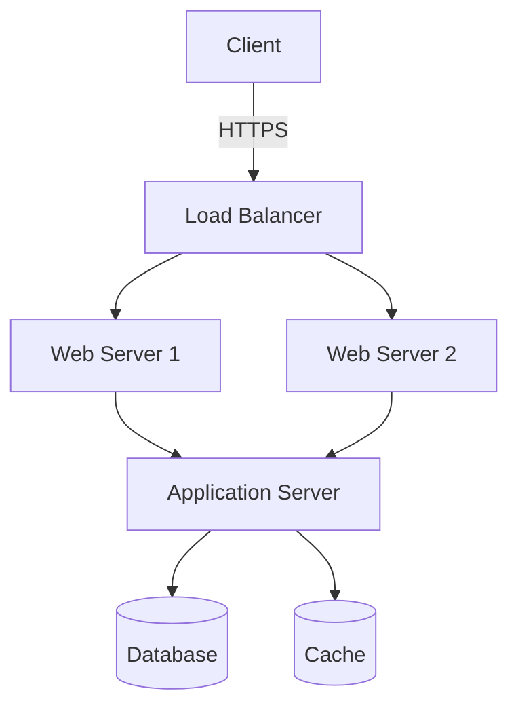

# Architecture Design Agents

A comprehensive suite of AI agents and skills to help technical architects generate software architecture designs, diagrams, and documentation using Claude AI.

## Overview

This project provides specialized agents that can analyze codebases, generate architecture diagrams in multiple formats, design APIs, visualize databases, and create comprehensive architecture documentation.

## Features

### 🏗️ Agents

1. **Architecture Analyzer Agent** - Analyzes codebases and generates architecture diagrams
2. **Diagram Generator Agent** - Creates diagrams in multiple formats (Mermaid, C4, PlantUML, draw.io)
3. **API Design Agent** - Designs and documents APIs with sequence diagrams
4. **Database Visualizer Agent** - Creates ER diagrams from database schemas
5. **Dependency Mapper Agent** - Maps dependencies and creates dependency diagrams
6. **Documentation Generator Agent** - Creates comprehensive architecture documentation

### 🎨 Diagram Formats Supported

- **Mermaid** - Flowcharts, sequence diagrams, class diagrams, ER diagrams, state diagrams
- **C4 Model** - Context, Container, Component, and Code diagrams
- **PlantUML** - UML diagrams, sequence diagrams, component diagrams
- **Draw.io XML** - Editable diagrams for Draw.io/diagrams.net

### 🛠️ Skills

- Diagram generation utilities
- Code analysis and pattern recognition
- Architecture pattern detection
- Documentation generation

## Project Structure

```
codingagents/
├── agents/                          # Agent implementations
│   ├── architecture-analyzer/       # Analyzes code and generates architecture
│   ├── diagram-generator/           # Generates diagrams in various formats
│   ├── api-designer/                # API design and documentation
│   ├── database-visualizer/         # Database schema visualization
│   ├── dependency-mapper/           # Dependency analysis and visualization
│   └── documentation-generator/     # Architecture documentation
├── skills/                          # Reusable skills
│   └── diagram-skills/              # Diagram generation capabilities
├── utils/                           # Utility functions
├── examples/                        # Example usage and outputs
│   ├── templates/                   # Architecture templates
│   └── output/                      # Sample generated diagrams
└── docs/                            # Documentation
```

## Quick Start

### Using Architecture Analyzer Agent

```python
from agents.architecture_analyzer import ArchitectureAnalyzer

analyzer = ArchitectureAnalyzer()
architecture = analyzer.analyze_codebase(
    path="/path/to/project",
    diagram_format="mermaid"  # or "c4", "plantuml", "drawio"
)
```

### Generating Diagrams

```python
from agents.diagram_generator import DiagramGenerator

generator = DiagramGenerator()

# Generate Mermaid diagram
mermaid = generator.generate_mermaid_diagram(
    diagram_type="flowchart",
    components=["Frontend", "Backend", "Database"]
)

# Generate C4 diagram
c4 = generator.generate_c4_diagram(
    level="container",  # context, container, component, code
    system="E-commerce Platform"
)
```

### API Design

```python
from agents.api_designer import APIDesigner

designer = APIDesigner()
api_spec = designer.design_api(
    requirements="RESTful API for user management",
    include_sequence_diagram=True
)
```

## Use Cases

### 1. Analyzing Existing Codebase
Automatically analyze your codebase and generate architecture diagrams showing:
- System components and their relationships
- Data flow
- Technology stack
- Architectural patterns used

### 2. Designing New Architecture
Use agents to help design new systems:
- Generate C4 diagrams for different abstraction levels
- Create sequence diagrams for API interactions
- Design database schemas with ER diagrams

### 3. Documentation Generation
Automatically generate comprehensive architecture documentation including:
- System overview
- Component descriptions
- Architecture decision records (ADRs)
- API documentation
- Deployment diagrams

### 4. Architecture Reviews
Analyze architecture and get suggestions for:
- Architectural patterns
- Scalability improvements
- Security considerations
- Best practices

## Agent Details

### Architecture Analyzer Agent

**Capabilities:**
- Scans codebase structure
- Identifies architectural patterns (MVC, microservices, layered, etc.)
- Detects technology stack
- Generates diagrams showing system structure
- Identifies dependencies between components

**Input:** Codebase path, analysis depth, diagram format preference
**Output:** Architecture diagrams, analysis report, technology stack summary

### Diagram Generator Agent

**Capabilities:**
- Mermaid diagrams (flowchart, sequence, class, ER, state, journey)
- C4 model diagrams (context, container, component, code)
- PlantUML diagrams (all UML types)
- Draw.io XML format

**Input:** Diagram specification, format preference, styling options
**Output:** Diagram code/XML, rendered preview (when applicable)

### API Design Agent

**Capabilities:**
- RESTful API design
- GraphQL schema design
- gRPC service definitions
- OpenAPI/Swagger specifications
- API sequence diagrams
- Request/response examples

**Input:** API requirements, design patterns, authentication needs
**Output:** API specification, sequence diagrams, documentation

### Database Visualizer Agent

**Capabilities:**
- ER diagram generation from schema
- Database relationship mapping
- Index and constraint visualization
- Migration planning diagrams

**Input:** Database schema (SQL, ORM models, existing DB connection)
**Output:** ER diagrams, schema documentation

### Dependency Mapper Agent

**Capabilities:**
- Service dependency mapping
- Package dependency analysis
- Circular dependency detection
- Dependency graph visualization

**Input:** Project configuration, package files, service definitions
**Output:** Dependency diagrams, dependency analysis report

### Documentation Generator Agent

**Capabilities:**
- Architecture Decision Records (ADRs)
- System overview documentation
- Component documentation
- README generation
- Markdown documentation with embedded diagrams

**Input:** Architecture analysis, custom requirements
**Output:** Comprehensive markdown documentation

## Example Outputs

### Mermaid Flowchart


### C4 Context Diagram
```
System Context diagram for E-commerce Platform
- Users interact with Web Application
- Web Application uses Payment Gateway
- Web Application uses Email Service
- Web Application uses Analytics Service
```

## Installation

```bash
# Clone the repository
git clone https://github.com/yourusername/codingagents.git
cd codingagents

# Install dependencies
pip install -r requirements.txt
```

## Configuration

Each agent can be configured via:
1. Configuration files (`config/`)
2. Environment variables
3. Direct parameters in code

Example configuration:
```yaml
architecture_analyzer:
  default_diagram_format: mermaid
  analysis_depth: deep
  include_external_dependencies: true

diagram_generator:
  mermaid_theme: default
  c4_styling: true
  output_format: svg
```

## Contributing

Contributions are welcome! Please see CONTRIBUTING.md for details.

## License

MIT License - see LICENSE file for details.

## Resources

- [Mermaid Documentation](https://mermaid.js.org/)
- [C4 Model](https://c4model.com/)
- [PlantUML](https://plantuml.com/)
- [Draw.io](https://www.diagrams.net/)

## Support

For issues, questions, or contributions, please open an issue on GitHub.
